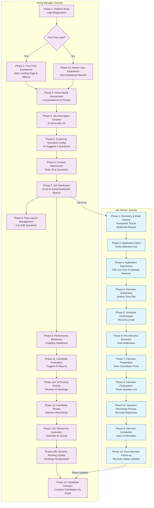

```mermaid
flowchart TD
    subgraph JobSeeker [Job Seeker Journey]
        direction TB
        A[Phase 1: Discovery & Initial Interest<br>Touchpoint: Social Media/Job Boards] --> B[Phase 2: Application Intent<br>Clicks Interview Link]
        B --> C[Phase 3: Application Submission<br>Fills Out Form & Uploads Resume]
        C --> D[Phase 4: Interview Scheduling<br>Selects Time Slot]
        D --> E[Phase 5: Schedule Confirmation<br>Receives Email]
        E --> F[Phase 6: Pre-Interview Reminder<br>Gets Notification]
        F --> G[Phase 7: Interview Preparation<br>Sees Countdown Timer]
        G --> H[Phase 8: Interview Participation<br>Views Question List]
        H --> I[Phase 8A: Question Recording Process<br>Records Responses]
        I --> J[Phase 9: Interview Completion<br>Sees Confirmation]
        J --> K[Phase 10: Post-Interview Follow-up<br>Receives Status Updates]
    end

    subgraph HiringManager [Hiring Manager Journey]
        direction TB
        L[Phase 1: Platform Entry<br>Login/Registration] --> M{First Time User?}
        M -- Yes --> N[Phase 2: First-Time Experience<br>Sees Landing Page & Metrics]
        M -- No --> O[Phase 2A: Return User Experience<br>Sees Dashboard Banner]
        N --> P[Phase 3: Hiring Needs Assessment<br>Conversational AI Prompt]
        O --> P
        P --> Q[Phase 4: Job Description Creation<br>AI Generates JD]
        Q --> R[Phase 5: Screening Questions Config<br>AI Suggests 5 Questions]
        R --> S[Phase 6: Content Refinement<br>Edits JD & Questions]
        S --> T[Phase 7: Job Distribution<br>Posts to Social Media/Job Boards]
        T --> U[Phase 8: Post-Launch Management<br>Can Edit Questions]
        T --> V[Phase 9: Performance Monitoring<br>Analytics Dashboard]
        V --> W[Phase 11: Candidate Evaluation<br>Triggers AI Reports]
        W --> X[Phase 11A: AI Scoring Review<br>Reviews AI Rankings]
        X --> Y[Phase 12: Candidate Review<br>Watches Recordings]
        Y --> Z[Phase 12A: Manual Re-evaluation<br>Overrides AI Scores]
        Z --> AA[Phase 12B: Dynamic Ranking Update<br>Rankings Recalculated]
        AA --> AB[Phase 13: Candidate Outreach<br>Contacts Candidates via Email]
    end

    %% Draw connections between the two journeys
    T -- Job Post --> A
    K -- Status Updates --> AB
    
    classDef jobSeeker fill:#e1f5fe,stroke:#01579b;
    classDef hiringManager fill:#f3e5f5,stroke:#4a148c;
    class A,B,C,D,E,F,G,H,I,J,K jobSeeker;
    class L,M,N,O,P,Q,R,S,T,U,V,W,X,Y,Z,AA,AB hiringManager;
```